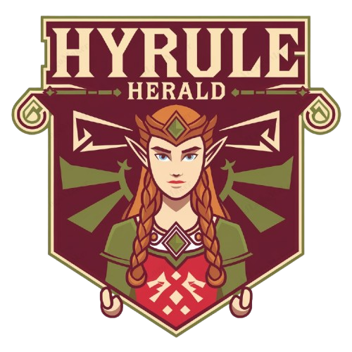

  

  

    

      HyruleHerald é um portal de notícias fictício ambientado no mundo de <em>The Legend of Zelda</em>. Criado especialmente para fãs da série, o site oferece as últimas atualizações sobre os eventos e transformações no reino de Hyrule, como explorações, descobertas de relíquias e mudanças após as batalhas contra Ganon.
    

    

    <h2>Tecnologias Utilizadas</h2>
    <ul>
    <li>HTML e CSS: O esqueleto e a aparência do site foram moldados usando esses pilares da web. Antes de começar, só sabia o básico de HTML e CSS, mas este projeto foi uma verdadeira jornada para aprimorar esses conhecimentos.
    <li>Flexbox: Responsável por organizar os elementos de forma fluida e responsiva, garantindo que o portal seja tão épico em qualquer dispositivo quanto uma das aventuras de Link.
    <li>Bootstrap: Embora não tenha saído de Kakariko Village, Bootstrap foi um valioso companheiro de viagem, ajudando a dar aquele toque especial e responsivo ao site.
    </ul>
    

    <h2>Origem</h2>
    

      Este projeto foi desenvolvido como parte das atividades do curso de programação do Instituto PROA.
    

  

  

    
  

  

